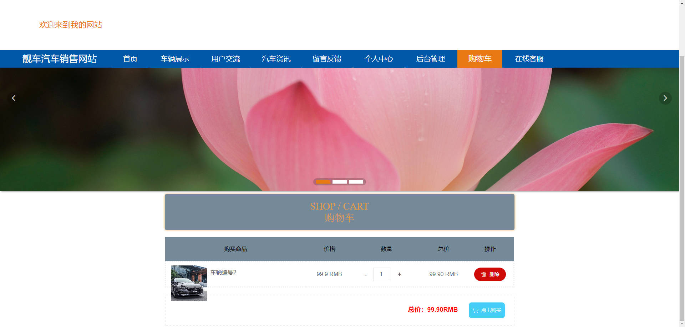
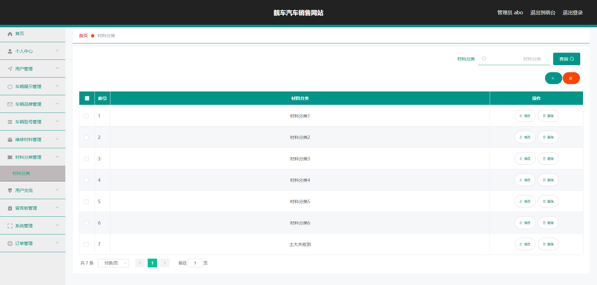

# 基于Springboot的靓车汽车销售网站

## Springboot-0086


## 技术栈

Springboot mybatisplus vue mysql maven


## 数据库表(18张)


## 功能介绍

```properties
靓车汽车销售网站

管理员功能有个人中心，用户管理，车辆展示管理，车辆品牌管理，车辆型号管理，维修材料管理，材料分类管理，

用户交流，留言板管理，系统管理，订单管理等。用户有个人中心，留言板管理，我的收藏管理
```


## 图片

### 前台





### 后台





## 访问路径

### 前台

```properties
http://localhost:8080/springbootil05r/front/pages/login/login.html

账号 11
密码 11
```

### 后台

```properties
http://localhost:8080/springbootil05r/admin/dist/index.html#/login

账号 abo
密码 abo
```


## 功能图


## 文档目录


## 打赏或交流


